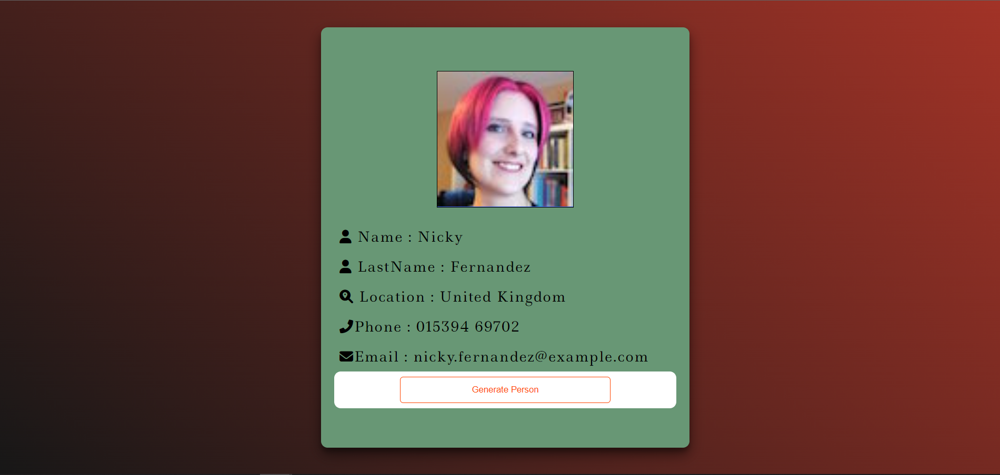

# Pokedex-with-SASS-SCSS

## Welcome! 👋

Thanks to visit my Github! In this project, I used HTML, CSS and JavaScript. This project created with flexbox. I used "Pokedex API". To get data from api, i used fecth method with async-await. For search bar, i checked all poke names if matches or not. 

**To do this project, i used HTML5, CSS(SCSS) and JavaScript.I used async-await to fetch data.**

## The challenge

Users should be able to:

- View the optimal layout for the site depending on their device's screen size
- You can see random user information on the screen.

### Links

- Live Site URL:https://omer-yagci.github.io/Random-User-Generator-API-SCSS/

**That Is What I Did!** 🚀
